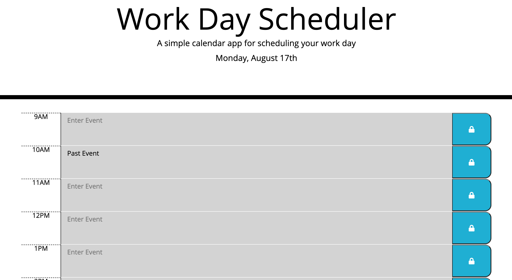

# 05 Third-Party APIs: Work Day Scheduler

This application was made using HTML, CSS, JavaScript and Moment.JS

The purpose of this app is to keep track of all of your past, current and future events.  

## Link to scheduler

[Click here to view](https://smith-work-day-scheduler.netlify.app)

## Screenshot of scheduler

